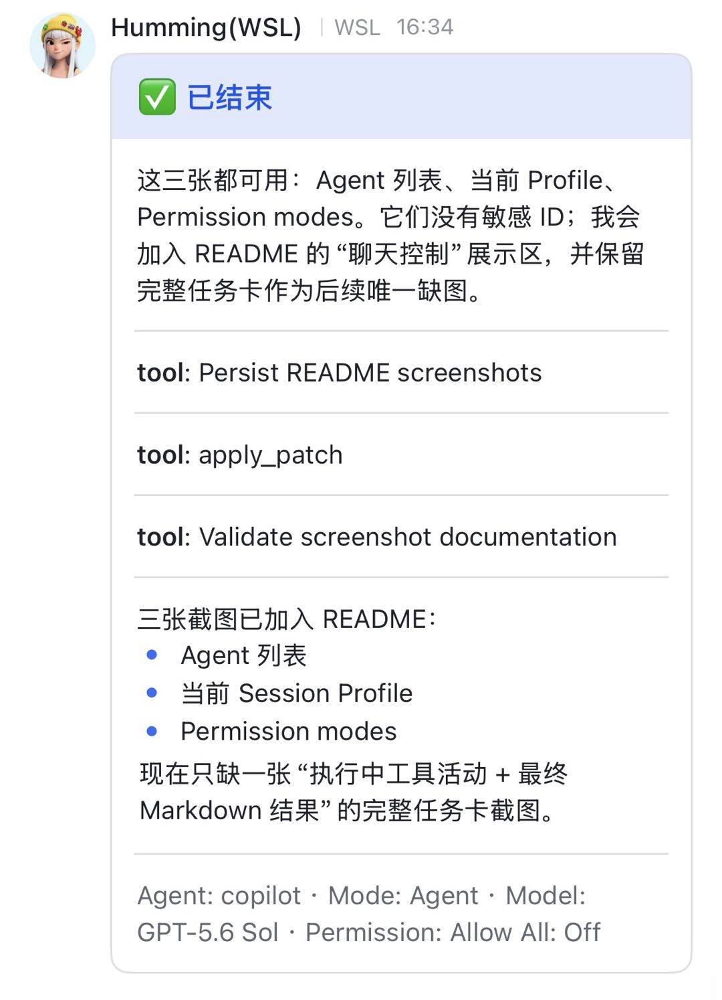
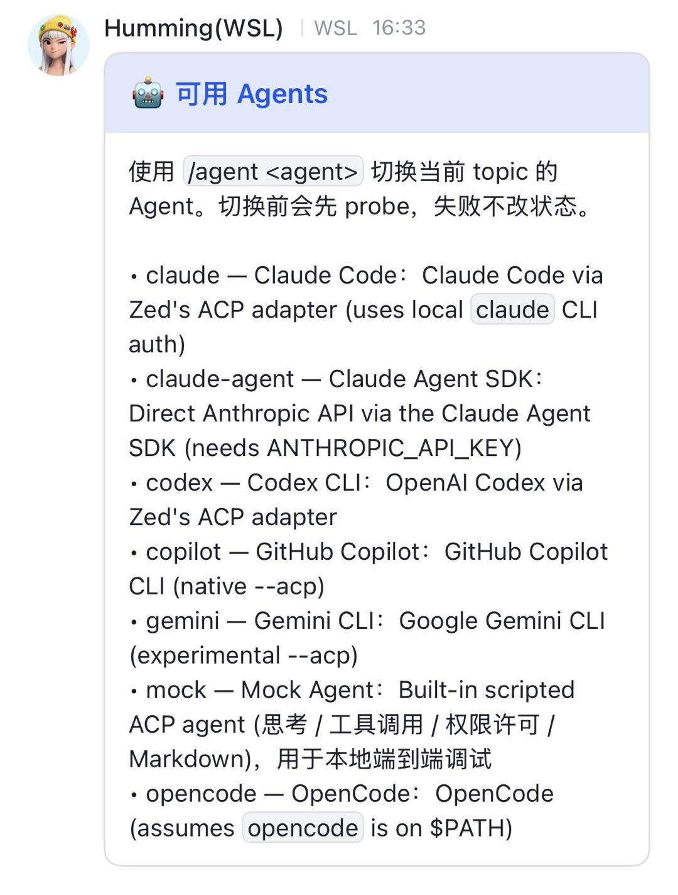
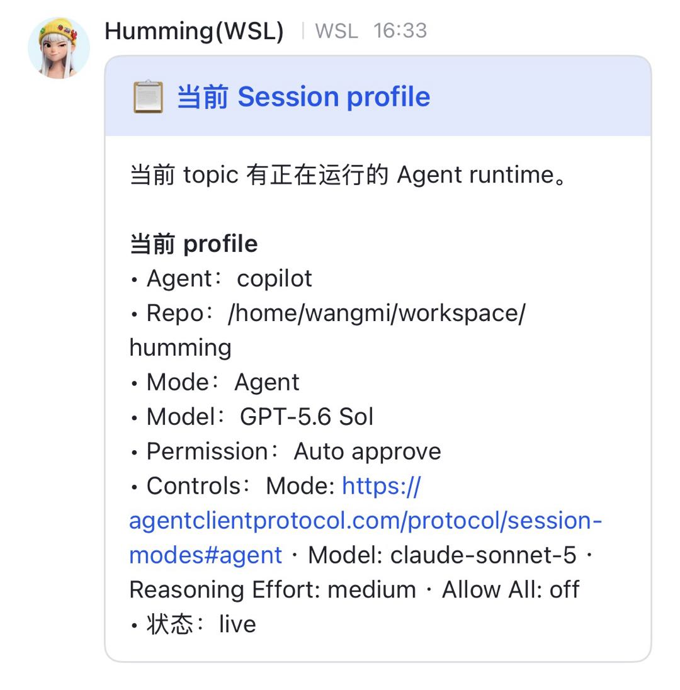
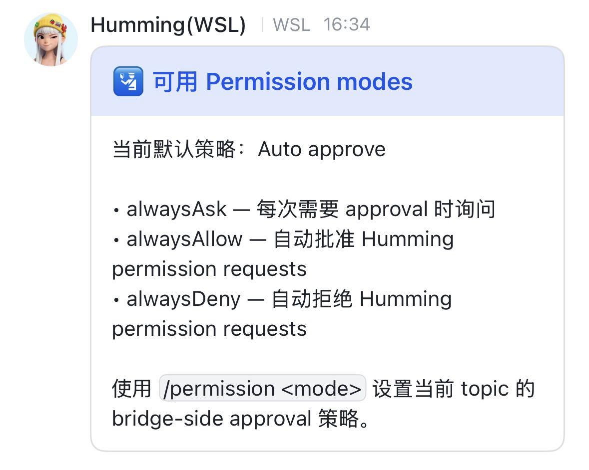

# Humming

[](https://www.npmjs.com/package/humming-agent)
[](https://www.npmjs.com/package/humming-agent)
[](./LICENSE)

**把飞书 / Lark 变成本地 Coding Agent 的客户端。**

Humming 是飞书 / Lark 与
[ACP](https://agentcommunicationprotocol.dev/core-concepts/architecture) Agent 之间的本地桥接服务。
你可以直接在聊天中把任务交给运行在自己电脑上的 Claude Code、Codex、GitHub Copilot、Gemini、
OpenCode 或其他 ACP Agent。

Humming 不直接请求 LLM。它负责 repo 绑定、Topic Session、Agent / Model / Mode / Permission /
Config 控制、流式互动卡片、中断与会话恢复；Agent、代码、凭据和工具仍留在运行 Humming 的机器上。

> Humming 仍在快速迭代。1.0 之前，CLI 和配置结构可能继续调整。

<p align="center">
  
</p>

## 为什么使用 Humming？

- **一个聊天，多种 Agent**：每个 topic 都可以独立选择 Agent、Model、Mode、Permission 和 ACP
  Config。
- **理解本地 repo**：chat 绑定本地仓库，topic 持有独立 Agent Session。
- **原生聊天体验**：思考、工具调用、Markdown 结果和权限请求都通过飞书 / Lark 互动卡片呈现。
- **会话可恢复**：Agent 支持时，Bridge 或机器重启后可以继续原有会话。
- **本地优先**：代码、Agent 进程、会话状态和凭据都保留在本机。
- **Agent 可操作 Humming**：Humming 会把当前 chat/topic 上下文注入 Agent，Agent 可以通过 CLI
  查询或配置当前会话。
- **跨平台**：支持 Windows、Linux、macOS 和 WSL。

## 工作方式

```text
飞书 / Lark
     │  WebSocket 事件 + 互动卡片
     ▼
Humming Bridge
     ├── chat → 本地 repo binding
     ├── topic → Agent Session + Session Profile
     ├── 权限与卡片生命周期
     └── ~/.humming 下的持久化状态
     │  ACP
     ▼
Claude Code / Codex / Copilot / Gemini / OpenCode / 自定义 Agent
     │
     ▼
本地仓库与工具
```

**Bridge** 是一个长期运行的本地进程。一个 chat 持有 repo binding，每个 chat topic 则持有独立的
**Topic Session** 和 **Session Profile**：

```text
Session Profile = Agent + Model + Mode + Permission + Config
```

切换 Agent 不会迁移另一个 Agent 的内部对话历史。Humming 会为目标 Agent 创建或恢复属于它的
session。

## 快速开始

### 环境要求

- Node.js 20 或更高版本
- Git 与 npm
- 飞书或 Lark 客户端
- 目标 Agent 自身要求的认证

例如，`claude` preset 使用本机 Claude Code 的登录状态；`claude-agent` 则需要
`ANTHROPIC_API_KEY`。

### 1. 安装

**Windows PowerShell**

```powershell
irm https://raw.githubusercontent.com/wangmingliang-ms/humming/main/install.ps1 | iex
```

**Linux、macOS 或 WSL**

```bash
curl -fsSL https://raw.githubusercontent.com/wangmingliang-ms/humming/main/install.sh | sh
```

安装脚本会把 managed checkout clone 到 `~/.humming/humming-project`，完成构建、链接全局
`humming` 命令，并初始化 home 模板。运行前请先安装 Node、npm 和 Git。

### 2. 创建并连接 Bot

```bash
humming setup
```

打开终端打印的 setup 链接，在飞书中登录，选择或创建群聊，并确认创建 Bot。Humming 会把返回的
凭据保存到 `~/.humming/settings.json`，不会在终端打印 App Secret。

国际版 Lark：

```bash
humming setup --domain lark
```

已有凭据时，setup 默认保留原配置。只有确实要替换凭据时才使用：

```bash
humming setup --force
```

### 3. 选择 Agent 并启动 Bridge

```bash
humming agent list
humming start --agent claude
humming status
humming logs -f
```

日志出现 `WebSocket connected` 后，在飞书 / Lark 中打开 Bot 并发送消息。

`--agent` 可以省略。Humming 会依次使用 `settings.json` 中的 `runtime.agent` 和内置默认
`claude`。

### 4. 绑定 repo

在聊天中发送：

```text
/bind /absolute/path/to/repository
```

随后创建一个 topic 并描述任务。chat 会保留 repo binding，每个 topic 则拥有自己的 session 和
profile。

未绑定的 chat 默认进入以 Humming home 为根目录的接待区。可以用 `runtime.unboundCwd` 指向其他
目录；设为空字符串则会要求先执行 `/bind`。

## 在聊天中使用

普通消息会交给当前 Agent。下面这些 slash command 会先由 Humming 处理，不会发送给 Agent。

| 命令                                 | 用途                                                |
| ------------------------------------ | --------------------------------------------------- |
| `/help`                              | 查看全部 Humming chat command                       |
| `/capabilities`                      | 查看当前 Agent 的 Model、Mode、Config 和 Permission |
| `/capabilities <agent>`              | 只 probe 另一个 Agent，不切换                       |
| `/agent` / `/agent <agent>`          | 查看 Agent 或切换当前 topic 的 Agent                |
| `/model` / `/model <id>`             | 查看或选择 Model；`/model auto` 清除显式覆盖        |
| `/mode` / `/mode <id>`               | 查看或选择 ACP Mode                                 |
| `/permission` / `/permission <mode>` | 查看或设置权限策略                                  |
| `/profile`                           | 查看当前 topic profile                              |
| `/bind <path>`                       | 把当前 chat 绑定到本地 repo                         |
| `/where` / `/unbind`                 | 查看或解除 repo binding                             |
| `/new`                               | 重置当前 topic 的 Agent Session                     |
| `/cancel`                            | 中断当前任务                                        |

`/commands`、`/restart`、`/stop`、`/pwd`、`/unpin` 等别名也可使用。以 `/help` 显示的当前列表
为准。

<table>
  <tr>
    <td align="center">
      <br>
      <sub>查看与切换 Agent</sub>
    </td>
    <td align="center">
      <br>
      <sub>当前 Topic Session Profile</sub>
    </td>
    <td align="center">
      <br>
      <sub>Permission 策略</sub>
    </td>
  </tr>
</table>

### Permission 策略

Agent 请求使用工具时，Humming 会应用以下 approval-card 策略之一：

| 策略          | 行为                       |
| ------------- | -------------------------- |
| `alwaysAsk`   | 显示权限卡片，等待用户选择 |
| `alwaysAllow` | 自动允许                   |
| `alwaysDeny`  | 自动拒绝                   |

这是 Humming 自己的权限卡片策略，不是 ACP 的统一 permission mode。Agent 可能通过自身的 Mode
或 Config 暴露额外的 plan/edit 控制。

## 支持的 Agent

运行 `humming agent list` 查看当前版本的全部 preset。

| Preset         | 接入方式                                                            |
| -------------- | ------------------------------------------------------------------- |
| `claude`       | 通过 Zed ACP adapter 接入 Claude Code，使用本机 Claude CLI 登录状态 |
| `claude-agent` | Claude Agent SDK ACP adapter，需要 `ANTHROPIC_API_KEY`              |
| `codex`        | 通过 Zed ACP adapter 接入 OpenAI Codex                              |
| `copilot`      | GitHub Copilot CLI 原生 ACP 模式                                    |
| `gemini`       | Google Gemini CLI 实验性 ACP 模式                                   |
| `opencode`     | OpenCode `acp`；要求 `opencode` 已在 `PATH` 中                      |
| `mock`         | 内置脚本 Agent，用于本地端到端测试                                  |

运行没有 preset 的 ACP server：

```bash
humming bridge run -- node ./my-agent.js --acp
```

只有前台 `bridge run` 接受 raw command。如果需要稳定地在后台运行，请在 `settings.json` 中添加
自定义 preset。

## CLI

```text
humming
├── run | start | stop | restart | status | logs
├── bridge
│   └── run | start | stop | restart | status | logs
├── agent
│   └── list | capabilities | models | modes | permissions
├── session
│   └── list | bind | capabilities | models | permissions | configure | send
├── setup
├── init
└── update
```

顶层进程命令是快捷方式：`humming start` 与 `humming bridge start` 完全等价。使用
`humming <command> --help` 查看所有选项。

### Bridge 生命周期

```bash
humming run --agent claude       # 前台运行，Ctrl-C 停止
humming start --agent claude     # 后台运行
humming status
humming logs -n 100
humming logs -f
humming restart                  # 沿用已保存的启动配置
humming stop
```

`start` 会保存启动配置，把日志写入 `~/.humming/bridge.log`，并在 Humming home 下记录受管
PID。Linux 上可用时会使用 systemd user service，其他环境使用 detached process。

restart 和 stop 是协调式生命周期操作：Bridge 会先停止接收新任务、等待正在处理的 turn、保存
session 状态，然后退出，并在需要时由独立 coordinator 拉起新进程。

### 查询 Agent 与 Session

`agent` 命令会短生命周期地 probe 任意 Agent：

```bash
humming agent capabilities --agent copilot --json
humming agent models --agent claude
```

`session` 命令操作当前 chat topic 的 live session：

```bash
humming session capabilities --json
humming session configure --model <model-id> --mode <mode-id>
humming session configure --permission alwaysAsk
humming session configure --config <config-id>=<value>
```

在 Humming 启动的 Agent 内执行时，session 命令会从 `HUMMING_CHAT_ID` 和
`HUMMING_THREAD_ID` 推导当前 scope。从外部终端执行时，需要传 `--chat-id`，必要时再传
`--thread-id`。

### 原子化修改 Profile 并发送消息

当一个请求既要修改 profile，又要发送任务时，应放在同一个命令中：

```bash
humming session configure \
  --agent copilot \
  --model <model-id> \
  --mode <mode-id> \
  --permission alwaysAsk \
  --message-file /absolute/path/to/task.md
```

Humming 会针对目标 Agent 校验 controls，在安全的 turn boundary 应用完整 profile，然后才发送
message。

只发送消息、不修改 profile：

```bash
humming session send --message "Fix the failing test"
humming session send --message-file /absolute/path/to/task.md
```

### 绑定已有 Agent Session

```bash
humming session list --agent claude --json
humming session bind --agent claude --session-id <session-id>
```

目标 session 必须属于当前 chat 所绑定的 repo，而且不能已被另一个 chat topic 占用。

## 配置

默认 home 是 `~/.humming`。主要文件如下：

| 路径                      | 用途                                                  |
| ------------------------- | ----------------------------------------------------- |
| `settings.json`           | 凭据、机器默认值、Agent preset 和 chat → repo binding |
| `sessions.json`           | Topic Session 与 Session Profile 状态                 |
| `bridge.log`              | 后台 Bridge 日志                                      |
| `bridge.pid`              | 受管进程标识                                          |
| `bridge.launch.json`      | 已保存的 Bridge 启动配置                              |
| `AGENTS.md` / `CLAUDE.md` | 提供给 Agent 的 Humming 操作说明                      |

使用 `--home <path>` 或 `HUMMING_HOME` 可以选择其他 home。`humming init` 会刷新说明模板并创建
`.back.json` 示例文件，不会覆盖真实 settings 或 sessions。

### `settings.json`

```jsonc
{
  "credentials": {
    "appId": "cli_xxxxxxxxxxxxxxxx",
    "appSecret": "xxxxxxxxxxxxxxxxxxxxxxxxxxxxxxxx",
  },
  "runtime": {
    "agent": "claude",
    "cwd": "/optional/default/repository",
    "unboundCwd": "/optional/reception/directory",
    "idleTimeoutMinutes": 1440,
    "maxChats": 10,
    "hideThoughts": false,
    "hideTools": false,
    "hideCancelButton": false,
    "groupRequireMention": false,
    "permissionMode": "alwaysAsk",
    "defaultControls": {},
    "lifecycleNotifyChatIds": [],
    "globalControlChatIds": [],
  },
  "agents": {
    "my-agent": {
      "label": "My ACP Agent",
      "command": "node",
      "args": ["/absolute/path/to/my-agent.js", "--acp"],
      "description": "Custom local agent",
      "env": {
        "MY_AGENT_SETTING": "value",
      },
    },
  },
  "bindings": {
    "oc_example_chat_id": {
      "cwd": "/absolute/path/to/repository",
    },
  },
}
```

`agents` 中的条目可以新增 preset，也可以只覆盖内置 preset 的部分字段。binding 只拥有 repo
路径；Agent、Model、Mode、Permission 和 Config 属于 topic session。

配置优先级：

```text
CLI option > 环境变量 > settings.json > 内置默认值
```

重要环境变量：

| 变量                                    | 用途                                |
| --------------------------------------- | ----------------------------------- |
| `HUMMING_HOME`                          | Humming home                        |
| `HUMMING_APP_ID` / `HUMMING_APP_SECRET` | Bot 凭据                            |
| `HUMMING_PERMISSION_MODE`               | 默认权限策略                        |
| `HUMMING_REF`                           | install/update 使用的 branch 或 tag |
| `HUMMING_CHAT_ID` / `HUMMING_THREAD_ID` | 注入 Agent 的当前 topic scope       |

请保护好 `settings.json`：其中包含 Bot App Secret，也可能包含 Agent 环境凭据。

## 更新与卸载

managed installation 可以自行更新：

```bash
humming update
```

update 会 fetch `origin`，把 managed checkout 硬同步到 `origin/$HUMMING_REF`（默认 `main`），
安装依赖、构建、刷新全局链接，并使用已保存的启动配置重启正在运行的 Bridge。managed checkout
中的本地修改会被覆盖。

安装指定 branch 或 tag：

```bash
HUMMING_REF=v0.2.0 sh install.sh
```

PowerShell 中请先设置 `$env:HUMMING_REF`，再运行 installer 或 update。

卸载全局命令：

```bash
curl -fsSL https://raw.githubusercontent.com/wangmingliang-ms/humming/main/uninstall.sh | sh
```

```powershell
irm https://raw.githubusercontent.com/wangmingliang-ms/humming/main/uninstall.ps1 | iex
```

卸载不会删除 `~/.humming`、managed checkout、凭据或 session history。

## 手动配置 Bot

推荐使用 `humming setup`。如果自动注册不可用，可以在
[飞书开放平台](https://open.feishu.cn/app)或
[Lark Developer Console](https://open.larksuite.com/app)创建企业自建应用：

1. 启用机器人能力。
2. 使用长连接接收事件。
3. 订阅 `im.message.receive_v1`。
4. 添加 `card.action.trigger` 回调。
5. 授予部署所需的消息读取/发送/更新、reaction、resource、chat、用户基础信息和 CardKit
   写入权限。
6. 发布应用，并把可见范围限制在实际用户。
7. 把 App ID 和 App Secret 写入 `settings.json` 的 `credentials`。

控制台步骤和权限名称以
[飞书 / Lark 服务端 API 文档](https://open.larksuite.com/document/server-docs/getting-started/getting-started)
为准。

## 本地开发

```bash
git clone https://github.com/wangmingliang-ms/humming.git
cd humming
npm install
npm run build
npm test
```

首次开发时链接本地构建：

```bash
npm link
```

修改代码后：

```bash
npm run build
humming restart
```

常用命令：

| 命令                | 用途                                                  |
| ------------------- | ----------------------------------------------------- |
| `npm run build`     | 编译 TypeScript 到 `dist/`，并为 CLI 入口添加执行权限 |
| `npm test`          | 使用 Vitest 运行单元与集成测试                        |
| `npm run fmt:check` | 检查格式                                              |
| `npm run dev`       | watch TypeScript 编译                                 |

单元测试与源码同目录，命名为 `*.test.ts`；集成测试位于 `tests/`。

## 项目状态与安全边界

- Humming 以本地用户权限运行 Agent。把 Bot 暴露给大范围群聊前，请确认 Agent command 和
  permission policy。
- `alwaysAllow` 会跳过交互确认，只应在可信环境使用。
- repo binding 会让 Agent 访问真实本地目录，请相应限制 Bot 可见范围和群成员。
- lifecycle 通知是 best-effort；本机诊断请使用 `humming status` 和 `humming logs`。
- Humming 提供便捷的后台进程管理；如果要求开机自启或持续崩溃恢复，仍建议使用平台级
  supervisor。

## 参考

- [Agent Communication Protocol](https://agentcommunicationprotocol.dev/)
- [飞书 / Lark 开放平台](https://open.larksuite.com/document/server-docs/getting-started/getting-started)
- [CLI command model](./docs/cli-command-model-SPEC.md)

## License

[MIT](./LICENSE)
